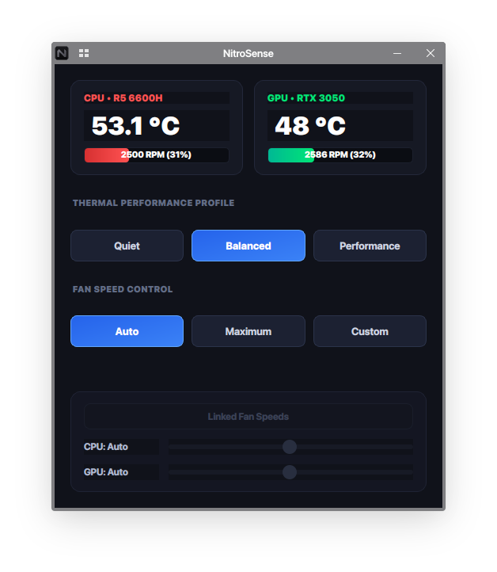
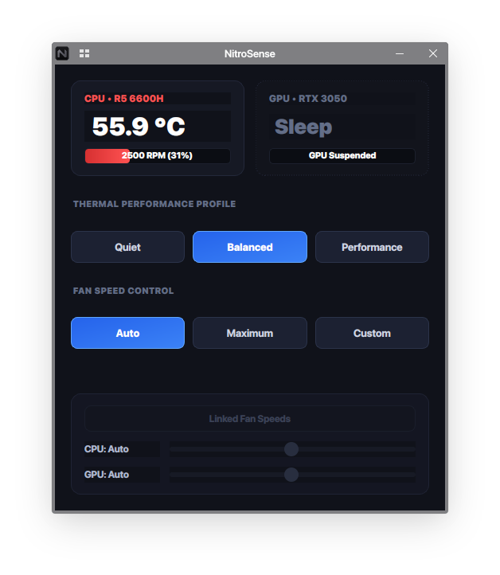

# NitroSense Linux & SCX Auto-Profile Suite

A comprehensive, low-overhead hardware management suite engineered for **Acer Nitro laptops running Linux** (specifically optimized for **CachyOS** and **Arch Linux**).

This project pairs a modern **PyQt6 NitroSense GUI** with an automated **SCX (sched-ext) scheduler and hardware daemon** to provide Windows-level fan and power control on Linux.

---

## 🖼️ Interface Preview

<p align="center">
  
  &nbsp;&nbsp;&nbsp;&nbsp;
  
</p>

---

## 🏗️ Architecture & Integration

```text
[NitroSense GUI (PyQt6)] 
       │
       ▼ (Changes profile: Quiet / Balanced / Performance)
[power-profiles-daemon]
       │
       ▼ (D-Bus signal: /net/hadess/PowerProfiles)
[SCX Auto-Profile Daemon (scx-auto-profile.sh)]
       ├── Sched-Ext Schedulers (scx_bpfland / scx_lavd / BORE default)
       ├── AMD CPU Turbo Boost (Toggled OFF in Quiet mode)
       ├── AMD EPP (Energy Performance Preference)
       ├── PCIe ASPM Power Management
       └── Acer WMI Thermal Profiles (/sys/devices/platform/acer-wmi)
```

---

## ✨ Features

- **PyQt6 Dark Interface:** Telemetry dashboard displaying live CPU/GPU temperatures, dynamic fan RPM indicators, and system tray integration.
- **Hardware Agnostic Discovery:** Dynamically detects CPU and NVIDIA GPU models; tracks GPU runtime power status (`suspended` / active) to prevent unwanted battery drain.
- **Synchronized & Custom Fan Sliders:** Supports Auto, Maximum, and Linked/Independent manual fan speeds.
- **SCX Scheduler Automation:**
  - **Performance:** Engages `scx_bpfland` for high-throughput gaming.
  - **Power-Saver:** Engages `scx_lavd -m powersave` and disables CPU Boost for absolute quiet and cool operation.
  - **Balanced:** Reverts to the default kernel scheduler (e.g., BORE).
- **Single Instance Toggle:** Pressing the shortcut or opening the launcher toggles the window via local IPC sockets without spawning duplicate processes.

---

## 📦 Prerequisites

### 1. Acer WMI Kernel Driver (CRITICAL)
The upstream vanilla Linux kernel does not expose custom fan speed nodes by default. You **must** install a patched Acer WMI kernel module such as `linuwu-sense-dkms`:

```bash
paru -S linuwu-sense-dkms # or yay -S linuwu-sense-dkms
```

*(After installing, reboot your system or run `sudo modprobe acer-wmi`).*

### 2. Software Dependencies
Install the required packages:

```bash
paru -S python-pyqt6 power-profiles-daemon scx-scheds
```

---

## 🚀 Installation & Setup

### 1. Install Udev Permissions (Allows Non-Root Control)
To control fan speeds and CPU boost without running the application as root, install the bundled udev rule:

```bash
sudo cp 99-nitrosense.rules /etc/udev/rules.d/
sudo udevadm control --reload-rules && sudo udevadm trigger
```

### 2. Run NitroSense GUI
```bash
./nitrosense-gui.py
```
*(You can bind this script to your keyboard's dedicated NitroSense key or a custom shortcut in KDE/GNOME).*

### 3. Enable Background Auto-Profile Daemon (systemd)
Run the auto-profile daemon in the background to automatically synchronize hardware power states:

```bash
mkdir -p ~/.config/systemd/user
cp scx-auto-profile.service ~/.config/systemd/user/
systemctl --user daemon-reload
systemctl --user enable --now scx-auto-profile.service
```

---

## 💻 Hardware Compatibility
- Tested and verified on **Acer Nitro 5 (AN515-46)** with AMD Ryzen 6000 Series + NVIDIA RTX 30 Series.
- Compatible with Acer Nitro and Predator laptops supported by `linuwu-sense` or `facer`.

---

## 📜 License
MIT License
